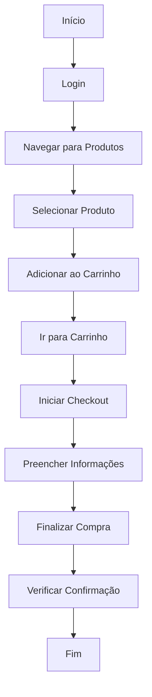
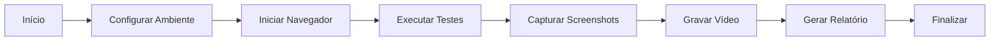
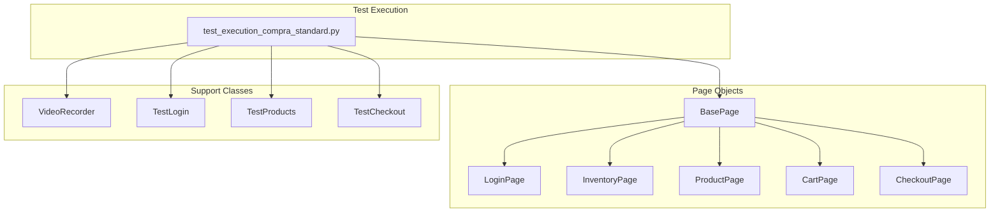
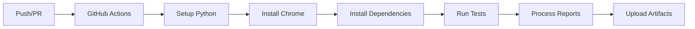

# Automação de Testes - E-commerce Saucedemo

Este projeto implementa testes automatizados para o site de e-commerce Saucedemo, utilizando Selenium WebDriver, Python e pytest. O objetivo é validar o fluxo completo de compra, desde o login até a finalização do pedido.

## 🚀 Tecnologias Utilizadas

- **Python 3.9**
- **Selenium WebDriver 4.18.1**
- **Pytest 8.3.5**
- **Pytest-HTML 4.1.1**
- **Pytest-Metadata 3.1.1**
- **MoviePy 1.0.3**
- **Faker 24.9.0**
- **ChromeDriver**

## 📋 Pré-requisitos

- Python 3.9 instalado
- Chrome Browser instalado
- Git instalado
- Ambiente virtual Python (recomendado)

## 🔧 Instalação

1. Clone o repositório:
```bash
git clone https://github.com/seu-usuario/DM_ECOMMERCE_SAUCEDEMO.git
cd DM_ECOMMERCE_SAUCEDEMO
```

2. Crie e ative um ambiente virtual:
```bash
python -m venv venv
.\venv\Scripts\activate  # Windows
source venv/bin/activate  # Linux/Mac
```

3. Instale as dependências:
```bash
pip install -r requirements.txt
```

### Variáveis de Ambiente

O projeto utiliza variáveis de ambiente para controlar o modo de execução:

- `HEADLESS`: Controla se o navegador será executado em modo headless
  - `true`: Executa sem interface gráfica (recomendado para CI/CD)
  - `false`: Executa com interface gráfica (recomendado para desenvolvimento)

Para configurar as variáveis de ambiente no Windows (PowerShell):
```powershell
# Modo com interface gráfica
$env:HEADLESS='false'

# Modo headless
$env:HEADLESS='true'
```

## 🏗️ Estrutura do Projeto

```
DM_ECOMMERCE_SAUCEDEMO/
├── classes/
│   └── ecommerce_saucedemo/
│       ├── __init__.py
│       ├── login.py
│       ├── products.py
│       ├── checkout.py
│       └── video_recorder.py
├── pages/
│   ├── __init__.py
│   ├── base_page.py
│   ├── login_page.py
│   ├── inventory_page.py
│   ├── product_page.py
│   ├── cart_page.py
│   └── checkout_page.py
├── tests/
│   └── id01_compra_standard/
│       ├── __init__.py
│       ├── id01_login.py
│       ├── id02_product.py
│       └── id03_checkout.py
├── test_execution/
│   └── test_execution_compra_standard.py
├── video/
├── .github/
│   └── workflows/
│       └── ci_full.yml
├── pytest.ini
├── requirements.txt
└── README.md
```

## 📊 Diagramas de Fluxo

### Fluxo de Compra Padrão


### Fluxo de Execução dos Testes


### Arquitetura do Projeto


### Pipeline CI/CD


## 📝 Configuração

### pytest.ini
O arquivo de configuração do pytest contém as seguintes configurações:
```ini
[pytest]
addopts =
    -v
    --html=relatorio_teste.html
    --self-contained-html
    --capture=sys
    --show-capture=log
metadata =
    Runner: GitHub Actions
    Python: 3.9
    Platform: Windows
```

### CI/CD Pipeline
O pipeline está configurado no arquivo `.github/workflows/ci_full.yml` e executa:
- Instalação do Chrome e ChromeDriver
- Instalação das dependências Python
- Execução dos testes
- Geração e upload do relatório de testes

## 🎯 Executando os Testes

### Localmente
```bash
pytest --html=relatorio_teste.html
```

### No GitHub Actions
Os testes são executados automaticamente em:
- Push para a branch principal
- Pull requests

## 📊 Relatórios

Os relatórios de teste são gerados em HTML e incluem:
- Status dos testes
- Screenshots em caso de falha
- Vídeos da execução dos testes
- Metadados do ambiente

Os relatórios são salvos em:
- Localmente: `relatorio_teste.html`
- GitHub Actions: Disponível como artefato da execução

## 🎥 Gravação de Vídeos

O projeto inclui funcionalidade de gravação de vídeos dos testes:
- Os vídeos são salvos no diretório `video/`
- Formato: MP4
- Nomeação: `test_[nome_do_teste]_[timestamp].mp4`

## 🔍 Monitoramento

O pipeline inclui monitoramento de:
- Status dos testes
- Tempo de execução
- Recursos utilizados
- Qualidade do código

## 🤝 Contribuição

1. Faça um fork do projeto
2. Crie uma branch para sua feature (`git checkout -b feature/AmazingFeature`)
3. Commit suas mudanças (`git commit -m 'Add some AmazingFeature'`)
4. Push para a branch (`git push origin feature/AmazingFeature`)
5. Abra um Pull Request

## 📄 Licença

Este projeto está sob a licença MIT. Veja o arquivo [LICENSE](LICENSE) para mais detalhes.

## 🎯 Sobre este Projeto

Este projeto foi desenvolvido como parte do processo seletivo para a vaga de QA Automation, demonstrando habilidades em automação de testes, boas práticas de desenvolvimento, e capacidade de implementar soluções robustas e escaláveis. A arquitetura e implementação refletem o compromisso com qualidade, manutenibilidade e eficiência no processo de testes.

## ✉️ Contato

Maxwell - [vmaxbh@gmail.com](mailto:vmaxbh@gmail.com)

Project Link: [https://github.com/seu-usuario/DM_ECOMMERCE_SAUCEDEMO](https://github.com/seu-usuario/DM_ECOMMERCE_SAUCEDEMO)
